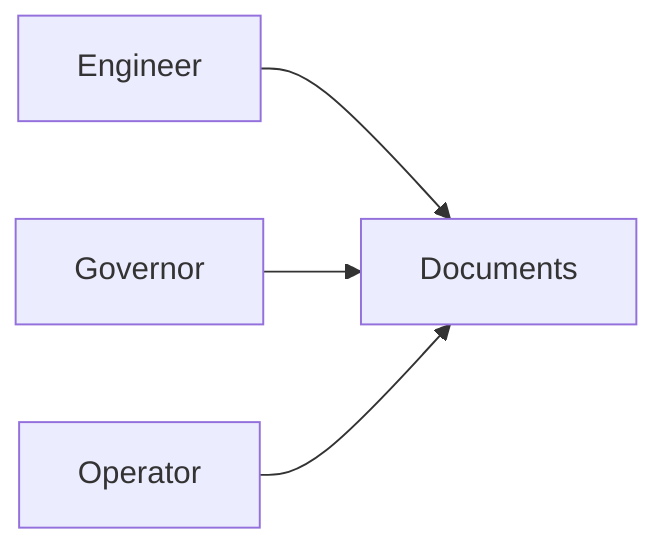
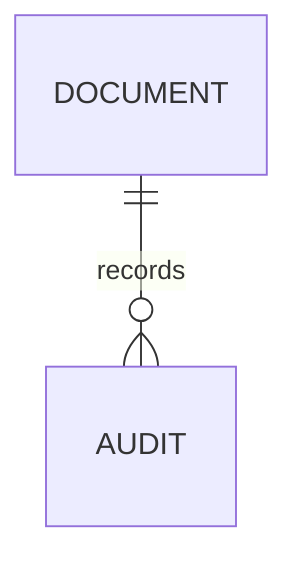
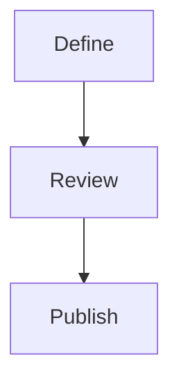
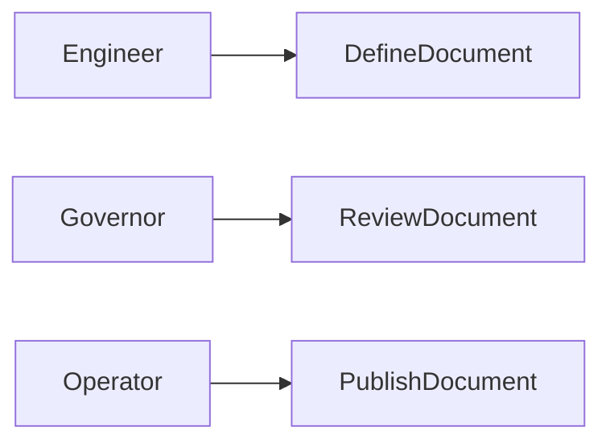
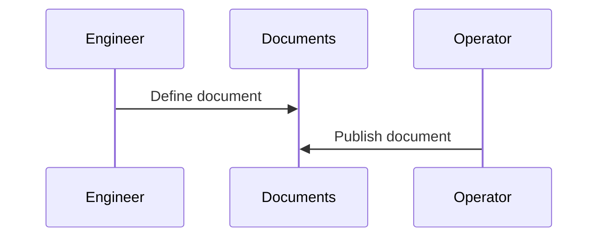

# MongoDB Supplier Document Governance Platform
## The Problem
Supplier documents lose integrity without schema review and controlled publication.
## The Solution
This service governs supplier documents through definition, review, publication, and audit evidence using MongoDB-oriented patterns.
## Live Demo & Tech Stack
The service binds to `0.0.0.0:22800` and uses Node.js, MongoDB patterns, Express, Vitest, and GitHub Actions.
## Local Setup & Run Instructions
```bash
npm install
npm test
npm start
```
## System Documentation (Mermaid.js)
### System Architecture Diagram

### Entity-Relationship Diagram

### Data Flow Diagram

### Use Case Diagram

### Sequence Diagram

## Owner
Created and maintained by Kholipha Ahmmad Al-Amin.
Software Engineer and AI Specialist
Founder and CEO of EquiSaaS BD
Principal Consultant at AR IT Consultancy
Full Stack Developer and SaaS Product Builder
### Official links
Portfolio: https://kholipha-ahmmad-al-amin.equisaas-bd.com/
GitHub: https://github.com/kholipha-ahmmad-al-amin
LinkedIn: https://www.linkedin.com/in/kholipha-ahmmad-al-amin
X: https://x.com/al_amin5519
Facebook: https://www.facebook.com/kholipha.ahmmad.al.amin
Instagram: https://www.instagram.com/kholipha.ahmmad.al.amin
## Ownership
This project was created and is maintained by Kholipha Ahmmad Al-Amin.

